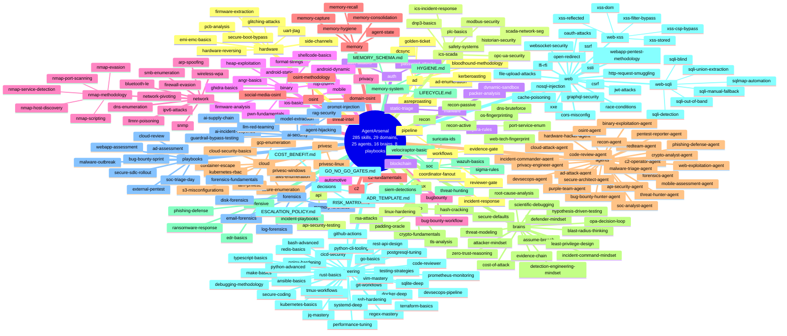

# AgentArsenal skill map

```mermaid
mindmap
  root((AgentArsenal
285 skills, 29 domains,
25 agents, 16 brains, 8 playbooks))
    ad
      ad-enumeration
      asreproasting
      bloodhound-methodology
      dcsync
      golden-ticket
      kerberoasting
    api
      api-security-testing
    auth
      auth-attacks
      password-attacks
    binary
      angr-basics
      firmware-analysis
      format-strings
      ghidra-basics
      heap-exploitation
      pwn-fundamentals
      rop-chains
      shellcode-basics
    bugbounty
      bug-bounty-workflow
    c2
      c2-fundamentals
    cloud
      aws-enumeration
      azure-enumeration
      cloud-security-basics
      container-escape
      gcp-enumeration
      iam-privesc
      kubernetes-rbac
      s3-misconfigurations
    crypto
      crypto-fundamentals
      hash-cracking
      padding-oracle
      rsa-attacks
      tls-analysis
    defensive
      edr-basics
      incident-playbooks
      phishing-defense
      ransomware-response
    engineering
      ansible-basics
      bash-advanced
      cicd-security
      code-reviewer
      debugging-methodology
      devsecops-pipeline
      docker-deep
      git-workflows
      github-actions
      go-basics
      jq-mastery
      kubernetes-basics
      make-basics
      nginx-hardening
      performance-tuning
      postgresql-tuning
      prometheus-monitoring
      python-advanced
      python-cli-tooling
      redis-basics
      regex-mastery
      rest-api-design
      rust-basics
      secure-coding
      sqlite-deep
      ssh-hardening
      systemd-deep
      technical-writing
      terraform-basics
      testing-strategies
      tmux-workflows
      typescript-basics
      vim-mastery
    forensics
      disk-forensics
      email-forensics
      forensics-fundamentals
      log-forensics
      memory-forensics
    incident
      incident-response
    linux
      linux-hardening
    malware
      dynamic-sandbox
      packer-analysis
      static-triage
      yara-rules
    mobile
      android-dynamic
      android-static
      ios-basics
    network
      arp-spoofing
      bluetooth-le
      dns-enumeration
      firewall-evasion
      ipv6-attacks
      llmnr-poisoning
      network-pivoting
      nmap-methodology
        nmap-evasion
        nmap-host-discovery
        nmap-port-scanning
        nmap-scripting
        nmap-service-detection
      smb-enumeration
      snmp
      wireless-wpa
    osint
      domain-osint
      osint-methodology
      social-media-osint
      threat-intel
    privesc
      privesc-linux
      privesc-windows
    recon
      recon-active
        dns-bruteforce
        os-fingerprinting
        port-service-enum
        web-tech-fingerprint
      recon-passive
    soc
      siem-detections
      sigma-rules
      suricata-ids
      threat-hunting
      velociraptor-basics
      wazuh-basics
    web
      cache-poisoning
      cors-misconfig
      csrf
      file-upload-attacks
      graphql-security
      http-request-smuggling
      jwt-attacks
      lfi-rfi
      nosql-injection
      oauth-attacks
      open-redirect
      race-conditions
      ssrf
      ssti
      web-sqli
        sqli-detection
        sqli-union-extraction
        sqli-blind
        sqli-out-of-band
        sqli-manual-fallback
        sqlmap-automation
      web-xss
        xss-reflected
        xss-csp-bypass
        xss-dom
        xss-stored
        xss-filter-bypass
      webapp-pentest-methodology
      websocket-security
      xxe
    ai-security
      agent-hijacking
      ai-incident-response
      ai-supply-chain
      guardrail-bypass-testing
      llm-red-teaming
      model-extraction
      prompt-injection
      rag-security
    hardware
      emi-emc-basics
      firmware-extraction
      glitching-attacks
      hardware-reversing
      pcb-analysis
      secure-boot-bypass
      side-channels
      uart-jtag
    ics-scada
      plc-basics
      modbus-security
      opc-ua-security
      scada-network-seg
      dnp3-basics
      historian-security
      ics-incident-response
      safety-systems
    blockchain
    automotive
    privacy
    memory
      agent-state
      memory-capture
      memory-consolidation
      memory-hygiene
      memory-recall
    agents
      ad-attack-agent
      ai-redteam-agent
      api-security-agent
      binary-exploitation-agent
      bug-bounty-hunter-agent
      c2-operator-agent
      cloud-attack-agent
      code-review-agent
      crypto-analyst-agent
      devsecops-agent
      forensics-agent
      hardware-hacker-agent
      incident-commander-agent
      malware-triage-agent
      mobile-assessment-agent
      osint-agent
      pentest-reporter-agent
      phishing-defense-agent
      privacy-engineer-agent
      purple-team-agent
      recon-agent
      secure-architect-agent
      soc-analyst-agent
      threat-hunter-agent
      web-exploitation-agent
    brains
      assume-breach
      attacker-mindset
      blast-radius-thinking
      cost-of-attack
      defender-mindset
      detection-engineering-mindset
      evidence-chain
      hypothesis-driven-testing
      incident-command-mindset
      least-privilege-design
      opa-decision-loop
      root-cause-analysis
      scientific-debugging
      secure-defaults
      threat-modeling
      zero-trust-reasoning
    memory-system
      MEMORY_SCHEMA.md
      LIFECYCLE.md
      HYGIENE.md
    decisions
      ESCALATION_POLICY.md
      RISK_MATRIX.md
      GO_NO_GO_GATES.md
      ADR_TEMPLATE.md
      COST_BENEFIT.md
    playbooks
      ad-assessment
      bug-bounty-sprint
      cloud-review
      external-pentest
      malware-outbreak
      secure-sdlc-rollout
      soc-triage-day
      webapp-assessment
    workflows
      pipeline
      coordinator-fanout
      reviewer-gate
      evidence-gate
```
