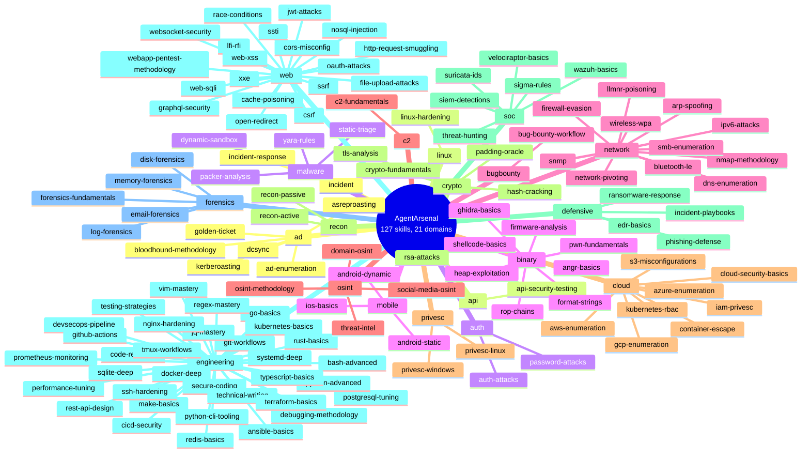

# AgentArsenal skill map

```mermaid
mindmap
  root((AgentArsenal
127 skills, 21 domains))
    ad
      ad-enumeration
      asreproasting
      bloodhound-methodology
      dcsync
      golden-ticket
      kerberoasting
    api
      api-security-testing
    auth
      auth-attacks
      password-attacks
    binary
      angr-basics
      firmware-analysis
      format-strings
      ghidra-basics
      heap-exploitation
      pwn-fundamentals
      rop-chains
      shellcode-basics
    bugbounty
      bug-bounty-workflow
    c2
      c2-fundamentals
    cloud
      aws-enumeration
      azure-enumeration
      cloud-security-basics
      container-escape
      gcp-enumeration
      iam-privesc
      kubernetes-rbac
      s3-misconfigurations
    crypto
      crypto-fundamentals
      hash-cracking
      padding-oracle
      rsa-attacks
      tls-analysis
    defensive
      edr-basics
      incident-playbooks
      phishing-defense
      ransomware-response
    engineering
      ansible-basics
      bash-advanced
      cicd-security
      code-reviewer
      debugging-methodology
      devsecops-pipeline
      docker-deep
      git-workflows
      github-actions
      go-basics
      jq-mastery
      kubernetes-basics
      make-basics
      nginx-hardening
      performance-tuning
      postgresql-tuning
      prometheus-monitoring
      python-advanced
      python-cli-tooling
      redis-basics
      regex-mastery
      rest-api-design
      rust-basics
      secure-coding
      sqlite-deep
      ssh-hardening
      systemd-deep
      technical-writing
      terraform-basics
      testing-strategies
      tmux-workflows
      typescript-basics
      vim-mastery
    forensics
      disk-forensics
      email-forensics
      forensics-fundamentals
      log-forensics
      memory-forensics
    incident
      incident-response
    linux
      linux-hardening
    malware
      dynamic-sandbox
      packer-analysis
      static-triage
      yara-rules
    mobile
      android-dynamic
      android-static
      ios-basics
    network
      arp-spoofing
      bluetooth-le
      dns-enumeration
      firewall-evasion
      ipv6-attacks
      llmnr-poisoning
      network-pivoting
      nmap-methodology
      smb-enumeration
      snmp
      wireless-wpa
    osint
      domain-osint
      osint-methodology
      social-media-osint
      threat-intel
    privesc
      privesc-linux
      privesc-windows
    recon
      recon-active
      recon-passive
    soc
      siem-detections
      sigma-rules
      suricata-ids
      threat-hunting
      velociraptor-basics
      wazuh-basics
    web
      cache-poisoning
      cors-misconfig
      csrf
      file-upload-attacks
      graphql-security
      http-request-smuggling
      jwt-attacks
      lfi-rfi
      nosql-injection
      oauth-attacks
      open-redirect
      race-conditions
      ssrf
      ssti
      web-sqli
      web-xss
      webapp-pentest-methodology
      websocket-security
      xxe
```
