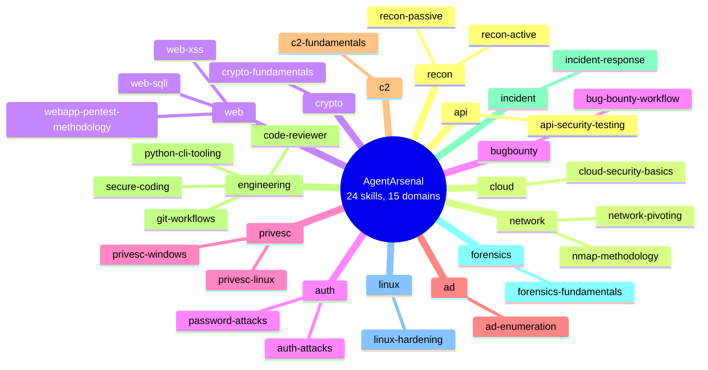

# AgentArsenal skill map

```mermaid
mindmap
  root((AgentArsenal
24 skills, 15 domains))
    recon
      recon-passive
      recon-active
    network
      nmap-methodology
      network-pivoting
    web
      web-sqli
      web-xss
      webapp-pentest-methodology
    auth
      auth-attacks
      password-attacks
    privesc
      privesc-linux
      privesc-windows
    ad
      ad-enumeration
    c2
      c2-fundamentals
    engineering
      code-reviewer
      python-cli-tooling
      git-workflows
      secure-coding
    incident
      incident-response
    forensics
      forensics-fundamentals
    linux
      linux-hardening
    api
      api-security-testing
    cloud
      cloud-security-basics
    crypto
      crypto-fundamentals
    bugbounty
      bug-bounty-workflow
```
